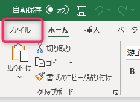
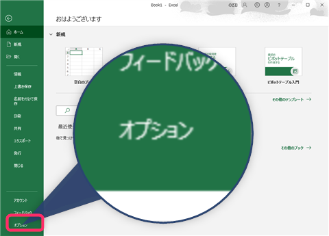
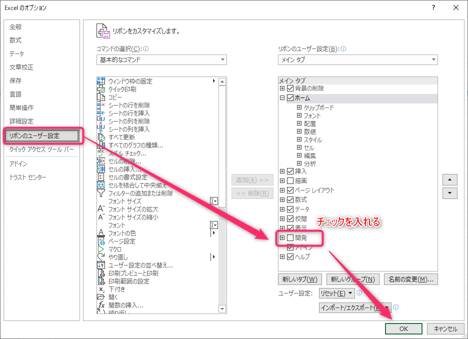
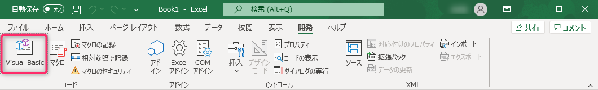
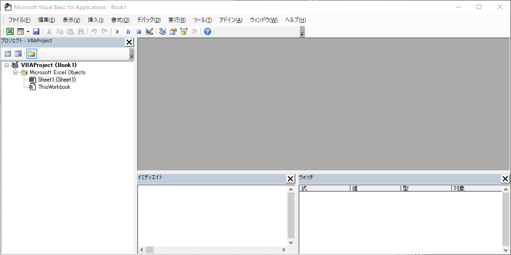

# 01-ExcelでのVBA開発環境構築

まずはExcel VBAでマクロ開発をするための初期設定と、起動方法の説明をします。 

---

## "開発"タブの表示設定

この設定は最初に一度だけやれば次回からは必要ありません。  

1. `ファイル`メニューから`オプション`を選択します。  

    

    

2. 表示されたExcelのオプション設定画面から
   - `リボンのユーザー設定`を選択し
   - 右側のウィンドウの中にある`開発`にチェックを入れてOKを押します。
    

3. すると上のメインメニューに`開発`が表示されます。
    

---

## VBAエディター(VBE)を起動する

プログラムコードを書いたり各種設定をしたりするためのウィンドウを開きます。  
このウィンドウはVBEditor(VBエディター)と呼ばれ、書籍やWebサイトによってはVBEと略されていることがあります。  

1. `開発`タブを開き、一番左端にある`Visual Basic`を押します。
    
2. すると`Visual Basic Editor`が開きます
    

