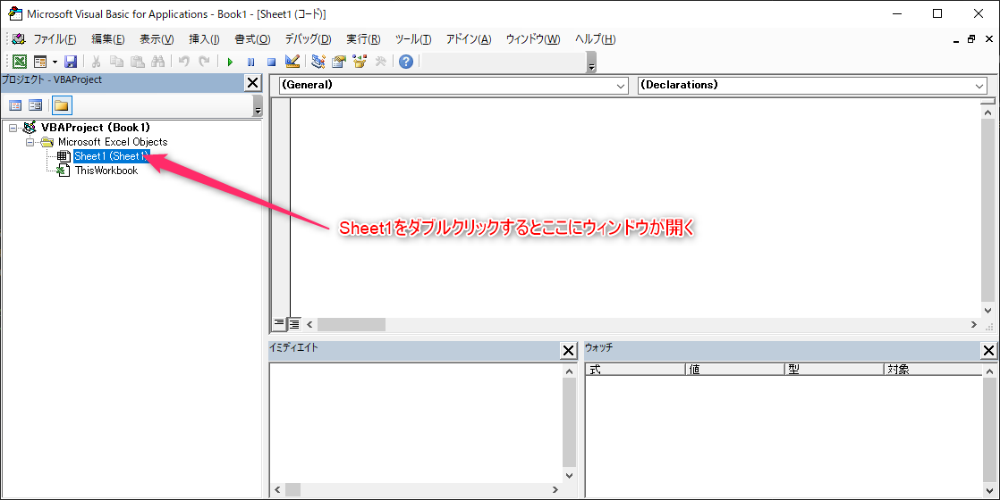
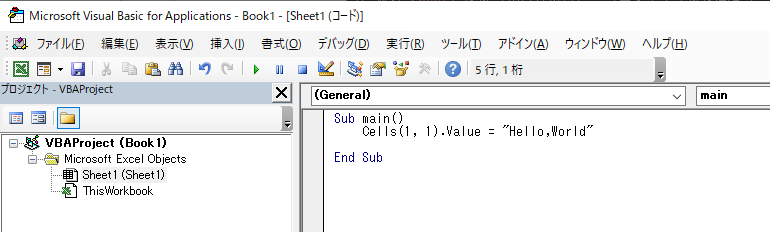
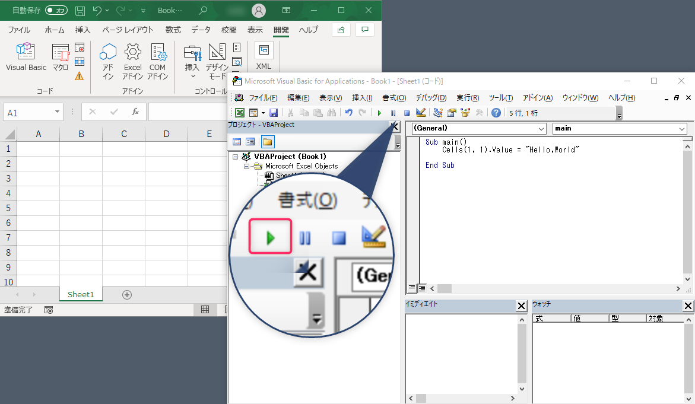
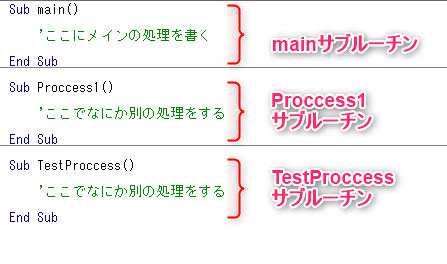
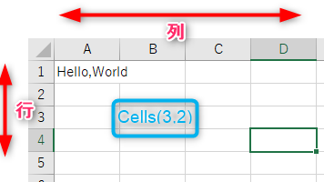
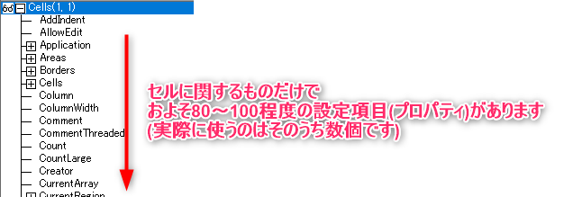

# まずは動かしてみる

理屈を学ぶ前にまずは動かしてみたいと思います。  
世の中のほとんどのプログラム入門書では伝統的に`Hello,World`を表示するプログラムから始めることになっていますので、ここでもそれに倣います。  

---
## Hello,Worldプログラムの作成と実行

1. VBEditorの左端ウィンドウにある`Sheet1`をダブルクリックし、コードエディタを開きます。  

    

2. 開いたコードエディタの中に、下図のようにプログラムを書いてください。  
    時間を取りますのでコピペではなく、直接記述してください。
    


```vb
Sub main()
    Cells(1, 1).Value = "Hello,World"
End Sub
```

3. デスクトップのウィンドウを整理し、下図のように左側にExcelシート、右側にVBEが表示される状態にしてください。  

    

4. できたら上図赤枠の再生ボタンを押します。
5. するとExcelシートのA1セルに`Hello,World`と表示されました。
    

おめでとうございます！  

初めてのマクロ作成に成功しました。  

手動でA1セルの値を消しても、再度実行ボタンを押せば再び`Hello,World`が表示されることを確認してください。  

<div style="page-break-before:always"></div>

---

## Hello,Worldプログラムの解説

---

これからプログラムの解説をしていきます。

### 1,3行目のSub main()～End Subについて

```vb
Sub main()
```
1行目のこの文はこれからmainという名前の`サブルーチン`を開始します。という意味です。

プログラムはできるだけ、処理のまとまりごとに小分けにすることで再利用しやすく、読みやすくなるのですが、その小分けにしたひとつのまとまりのことになります。  

実際に複数のサブルーチンを作成した場合、下図のようになります。  



上図のように`サブルーチン`はSubで始まり、その後は名前をつけます。今回は`main`という名前にしましたが、分かりやすければ何でも構いません。  

ただし、名前を数字から始めることはできないなど、いくつかの制約があります。  
今はあまり気にする必要はありません。  

名前のあとの半角カッコは必ずつけておいてください。今は中身がありませんが、必要に応じて  
```vb
Sub main(UserName as String)as Integer
```
などのようにオプションを増やしていくことができます。  

```Sub```から開始されたサブルーチンは、3行目の

```vb
End Sub
```
で終了となります。  

### 2行目について

```vb
    Cells(1, 1).Value = "Hello,World"
```
についてです。  
ここが今回のマクロの肝の部分となります。

左辺の```Cells(1,1)```は、このプログラムが書かれているSheetの座標(1,1)
にあるセルのことを示しています。  

カッコの中に記載されている座標は、(行,列)の順に示すというルールになっています。  

例えば下図B3セルはCellsで表記する場合
```vb
    Cells(3,2)
```
となります。  



では、`Cells(1,1)`の後に書かれている`.Value`はどういう意味かというと、そのセルに入力されている値のことを示しています。  
Excelのセルは数値や数式を入力できるだけでなく、書式設定や文字色、背景色など様々な設定や入力が可能です。  
そのため、それらをプログラムで操作できるように様々な設定項目が用意されています。  



ざっと数えただけで80～100以上の設定項目があるため、Cells(1,1)のどの項目を変更したいのかを明確にする必要があるのです。(ちなみに、全て覚える必要はありません)  

今回はそのうち、入力されている値を変更したいので、入力値を示す`.Value`を指定しています。

右辺の`"Hello,World"`は左辺に代入したい値を書いています。  

左辺と右辺をつなぐ`=`は数学の世界では等しいということを表しますが、プログラムの世界では`等しくする`、つまり代入するということを表す場合もあります。

`Hello,World`を`"`(ダブルクォーテーション)で囲っているのは、VBAの文法として、文字列は`"`で囲むことというルールがあるためです。  
ここはルールなので、そういうものだと覚えてください。  

つまり、まとめると
```vb
    'セルA2の   値を      Hello,Worldにする
    Cells(1, 1).Value = "Hello,World"
```

ということになります。

