# 02-マクロの記録をやってみる

本格的にVBAを学ぶ前に、プログラムを書かずにマクロを作ってみましょう。  

何でも良いので表を開いてください。  

今回は例としてこのような表を作成しました。  
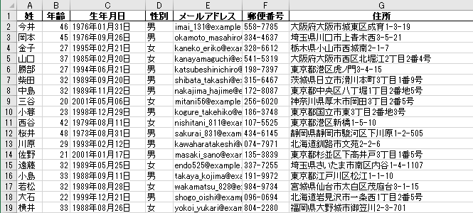

もしも手頃なデータが無い場合には下記リンクのダミーデータ生成サービスから適当な表を作成して使用してください。  

[個人情報テストデータジェネレータ](https://testdata.userlocal.jp/)

データを開いたら`開発`タブを開いておきます。  

次に**マクロの記録**を押し、  
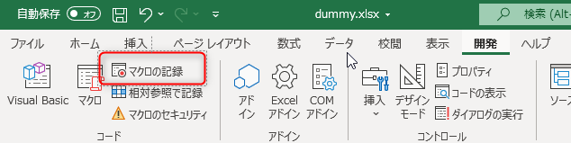  

この画面が出てきたらそのままOKを押します。  
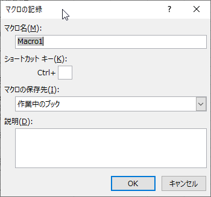  

そのままデータを全て選択し  
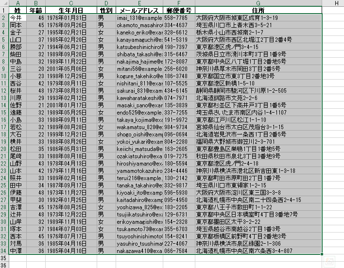  

`DELETE`キーを押してデータを削除してください。  

そのまま続けて`記録終了`を押します。  
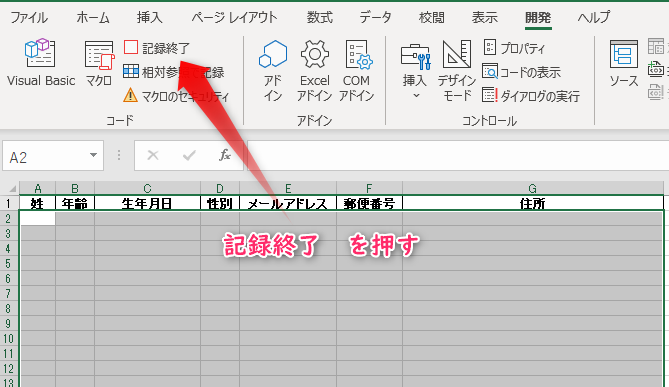  

`記録終了`が出来たら、`Ctrl + Z`を押して先程消したデータを復活させておきます。  

そのまま`Visual Basic`のボタンを押すと`Visual Basic Editor`というものが起動します。  
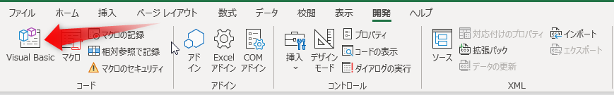  

画面左端のツリー表示を探すと`Module 1`というものがあるはずですので、これをダブルクリックします。  
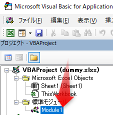  

すると、先程行った「指定した範囲のデータを消す」という動作が記録されたプログラムが表示されています。  

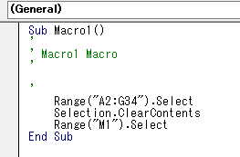

Excelに戻り、  
開発→挿入→ボタン(フォームコントロール)を選びます。  
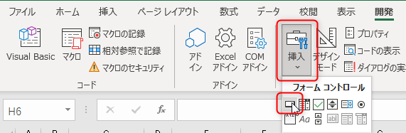  

適当な位置をドラッグしてボタンを配置します。  

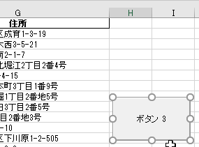  

配置した瞬間、このような画面が表示されますので、Macro1を選択してOKを押します。  

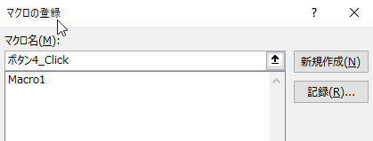  

ボタンが押せるようになっているので、このボタンを押すと先程記録した「指定した範囲のデータを消す」という動作が実行されます。  

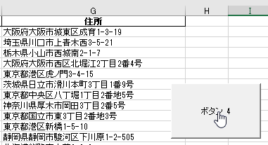  

このように、`マクロの記録`を使うと単純な動作であればプログラムを書かずにマクロを作成することが出来ます。  

