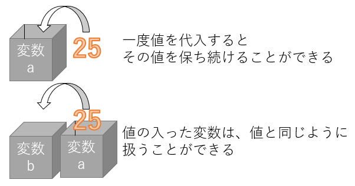

# 変数と演算について

プログラムの基本的な流れは、入力→処理→出力と言えます。  

プログラムを使うユーザーが最終的に必要なのは出力された結果であり、結果を出力するためには何らかの材料が必要です(入力)  
入力したものをそのまま出力しても仕方ありませんので、その間には何らかの加工や処理が必要となるはずです。  


前節ではセルに対して任意の文字列を表示することができました。  
これは、`出力`ができるようになったということになります。  

今回は`処理`をするために必要となる`変数`と、一番簡単な処理である`演算`のやり方を紹介します。  

## 変数とは

変数とは、数値や文字を一時的に入れることのできる空き箱のようなもの、とよく説明されます。  


変数を作成した直後には何も入っていませんが、一度その中に数値や文字を代入すると、次に書き換えられるまでの間はずっと同じ値を持ち続けています。  

値を代入した変数は、値そのものと同じように扱うことができます。  
そのため、変数に別の変数を代入することもできます。  



実際に使ってみましょう。

先ほどと同じようにVBEを起動し、Sheet1のコードエディタに下記プログラムを入力してください。  

```vb
Sub main()

    Dim A As Integer
    Dim B As Integer
    
    A = 20
    B = 3
    
    Cells(1, 1).Value = A + B
End Sub


```