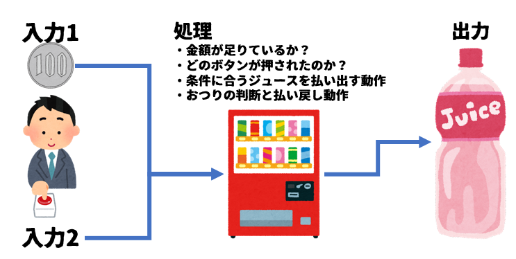

# 04-変数と演算について

プログラムの基本的な流れは、入力→処理→出力と言えます。  


この一連の`入力→処理→出力`について、`自動販売機`を例にとって説明すると  


`入力`は投入されたお金と、人がボタンを押す動作になります。  
`処理`は  
- どのボタンを押したのか？のチェック
- 押されたボタンに設定された金額が、投入されたお金が足りているかのチェック
- 上2つのチェックがOKだった場合、機械に指示をして該当するジュースを払い出す動作
- おつりが必要かどうかのチェックと、必要に応じておつりを払い戻す動作  

`出力`は払い出されたジュースということになります。  

処理が正しくないと、コーラを押したのに熱いおしるこが出てきたり、150円入れたのにコーラとおつり500円が出てきたりなど、様々な不具合が発生します。


前節ではセルに対して任意の文字列を表示することができました。  
これは、`出力`ができるようになったということになります。  
自販機の例で言えば、ジュースを払い出せるようになりました。

今回は`処理`をするために必要となる`変数`と、一番簡単な処理である`演算`のやり方を紹介します。  

## 変数とは

変数とは、数値や文字を一時的に入れることのできる空き箱のようなもの、とよく説明されます。  


変数を作成した直後には何も入っていませんが、一度その中に数値や文字を代入すると、**次に書き換えられるまでの間は**ずっと同じ値を持ち続けています。  

値を代入した変数は、値そのものと同じように扱うことができます。  
そのため、変数に別の変数を代入することもできます。  


実際に使ってみましょう。

先ほどと同じようにVBEを起動し、Sheet1のコードエディタに下記プログラムを入力してください。  

```vb
Sub main()

    Dim A As Integer
    Dim B As Integer
    
    A = 20
    B = 3
    
    Cells(1, 1).Value = A + B
End Sub
```

`Cells(1,1).Value=`
は先ほどと同じく、A1セルに結果を表示するための行です。  
Aに20、Bに3を代入したのでA+Bの結果が表示されます。  

では、さらに追加してみましょう
```vb
Sub main()

    Dim A As Integer
    Dim B As Integer
    
    A = 20
    B = 3
    
    Cells(1, 1).Value = A + B

    B = 10
    
    Cells(2, 1).Value = A + B
End Sub
```

A=20,B=3の状態で、A+Bの結果をA1セルに。  
Aは変更せず、Bだけを10に変更した状態でのA+Bの結果をB1セルに出力します。  

では、ここから細かく解説していきます。  

### 変数の宣言

VBAでは新しく変数を作成するときに`Dim`というコマンドを使います。  
なお、新しく変数を作成することを「変数を宣言する」と表現します。

```vb
    Dim A as Integer
```
と書くと、Aという箱をInteger(インテジャー)型として用意する。という意味になります。

Integer型というのは変数の種類を表しており、-32,768 ～ 32,767の範囲の整数しか入らないタイプの変数です。

他にも変数には下表のような種類があり、箱(変数)の中に何を入れるかによって使い分けることができますが、「何が入るかまだ分からない」時や「何でも入れられるようにしたい」というときは単に
```vb
    Dim A
```
と書けば「何でも入る変数」とすることもできます。(下表最下行の`Variant型`)  
「何でも入る変数」は便利ですが思わぬエラーやバグの原因になったり、マクロ実行速度が低下する原因になったりする場合があります。プログラムに慣れてきたら適切な型を選択するクセをつけておきましょう。  

ところで、下表を見ると種類がたくさんあり、ちょっとうんざりすると思います。  
ですが、これをすべて覚える必要はありません。  

まずはこのあたりを覚えておけば十分です。
```txt
    Integer型   32767までの整数しか入らない
    Long型      かなり大きな整数が入る。エクセルの行・列を扱うならこっちがいい
    Double型    小数を扱うときにはこれ
    String型    文字を使うときにはこれ
    Date型      日付・時間を扱うときはこれ
    Variant型   よくわからなくなったらこれ
```


| データ型 | 名称                 | 格納できる範囲                                          |
| -------- | -------------------- | ------------------------------------------------------- |
| Integer  | 整数型               | -32,768 ～ 32,767                                       |
| Long     | 長整数型             | -2,147,483,648 ～ 2,147,483,647                         |
| LongLong | 64ビット符号付き数値 | -9223372036854775808 ～ 9223372036854775807             |
|          |                      | ※64ビットプラットフォームのみで有効な宣言型             |
| Single   | 単精度浮動小数点数型 | -3.402823E38 ～ -1.401298E-45(負の値)                   |
|          |                      | 1.401298E-45 ～ 3.402823E38(正の値)                     |
| Double   | 倍精度浮動小数点数型 | -1.79769313486232E308 ～ -4.94065645841247E-324(負の値) |
|          |                      | 4.94065645841247E-324 ～ 1.79769313486232E308(正の値)   |
| Currency | 通貨型               | -922,337,203,685,477.5808 ～ 922,337,203,685,477.00     |
| String   | 文字列型             | 最大約20億文字まで                                      |
| Date     | 日付型               | 西暦100 年1月1日～西暦9999年12月31日までの日付と時刻    |
| Byte     | バイト型             | 0～255の範囲の単精度の正の数値。8 ビット(1 バイト)      |
| Boolean  | ブール型             | 真 (True) または偽 (False)                              |
| Object   | オブジェクト型       | オブジェクト                                            |
| Variant  | バリアント型         | すべてのデータ                                          |


話を戻します。  

```vb
    Dim A As Integer
    Dim B As Integer
```

この段階で2つの箱(変数)が作成されました。  
この2つの変数にはまだ値が入っていないため、中身はカラの状態です。  

これから変数A、変数Bにそれぞれ値を代入していきます。  

```vb
    A = 20
    B = 3
```
これでAは20の値を、Bは3の値を持つことになりました。  

つまりA+Bというのは20+3と言い換えることができます。  
20+3の結果を1行目1列のセル(A1セル)の値とします。
```vb
    Cells(1, 1).Value = A + B
```

次にBの値を10に書き換えます。  
先ほどと同じくA+Bの結果を2行目1列(A2セル)の値とします。  
A+Bという式は先ほどと同じですが、Bの値が10に書き変わっているので20+10となり、結果の30がA2セルに表示されます。

```vb
    B = 10
    
    Cells(2, 1).Value = A + B
```

### 演算(算術演算子)

サンプルでは足し算を行いましたが、それ以外の計算ももちろん可能です。  
以下にVBAで用いることができる算術演算の書き方を紹介します。  

これ以外の計算については記号ではなく専用の関数を用いて結果を得ます。  


| 演算子 | 説明         | 例      | 得られる結果 |
| ------ | ------------ | ------- | ------------ |
| +      | 足し算       | 8 + 5   | 13           |
| -      | 引き算       | 10 - 4 | 6            |
| *      | 掛け算       | 3 * 5   | 15           |
| /      | 割り算       | 8 / 5  | 1.6          |
| ¥      | 割り算の商   | 8 ¥ 5   | 1            |
| Mod    | 割り算の余り | 8 Mod 5 | 33           |
| ^      | べき乗       | 6 ^ 2   | 36           |

## まとめ

- `変数`とは、様々な値を入れて置ける箱の事
- `変数`にはその中に入れるものによって様々な種類がある(変数の型と言います)
- VBAには何でも入る`変数`もある(Variant型)
- 簡単な計算は記号を使って計算することができる。加減乗除＋商＋余り＋べき乗
