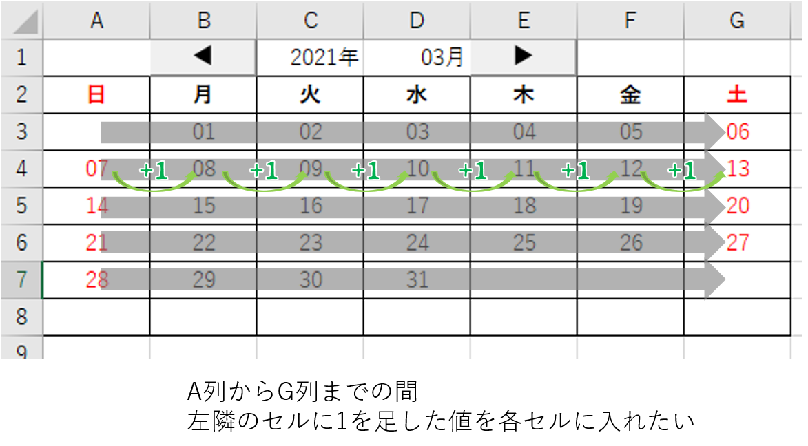

# For文の基礎的な文法

## For文とは何か

プログラムを作成していると、「何度も同じことをやりたい」という状況が頻繁に登場します。  

今回の目的である万年カレンダーの作成の場合で言えば、A列からG列までの間、前日の値に+1日した数値を入力するということを6回くりかえしたいというような事もそれにあたります。


もちろん、これまでの章でやったことだけでも実現は可能です。  

たとえば

```vb
    Cells(1, 1).Value = 1
    Cells(1, 2).Value = Cells(1, 1).Value + 1
    Cells(1, 3).Value = Cells(1, 2).Value + 1
    Cells(1, 4).Value = Cells(1, 3).Value + 1
    Cells(1, 5).Value = Cells(1, 4).Value + 1
    Cells(1, 6).Value = Cells(1, 5).Value + 1
    Cells(1, 7).Value = Cells(1, 6).Value + 1
    Cells(2, 1).Value = Cells(1, 7).Value + 1
    Cells(2, 2).Value = Cells(2, 1).Value + 1
    Cells(2, 3).Value = Cells(2, 2).Value + 1
    Cells(2, 4).Value = Cells(2, 3).Value + 1
            ・
            ・
            ・
```
というようなことを全31行記入すればいいのですが、面倒です。  
また、今回はたまたま月のカレンダーであるため、書いてもせいぜい31行ですが、これが年間カレンダーだったり、全社員に対する処理だったりすると数百から千行以上同じことを書く必要がでてきてしまい、現実的ではありません。  

そのため、VBAには`For ～ Next構文`という繰り返し処理のためのルールが用意されています。

イメージとしては以下のようなものです。  


プログラムは上から順々に流れてきますが、For ～ Next構文(図の緑の場所)に入ると、For で定義された回数分、処理が繰り返し行われます。

何回繰り返すのか？は一番最初に決めておきます。  

## For～Next構文を動かしてみる


実際にプログラムを書いて実行してみましょう。  
3章でHelloWorldを書いたプログラムを下記のように書き換えます。  

```vb
Sub main()
    Dim i as Integer
    For i = 1 To 3
        msgbox "テスト",vbOkOnly
    Next
End Sub
```

上記プログラムで初めて登場した```msgbox```は画面にメッセージを表示する命令(関数)です。  

3章の時と同じように再生ボタンを押して実行してみましょう。  

すると、下図のようなメッセージが合計3回表示されます。  


### プログラムの解説

では細かく解説していきます。  

```vb
    Dim i as Integer
```
このあとのFor ～ Nextで使用する変数、iを宣言します。iには数値を入れるのでInteger型を指定しています。  

```vb
    For i = 1 To 3
```

ここから繰り返しが始まります。  
まず` i = 1 `の部分で、iに初期値として1を代入します。  
次に` To 3 `の部分で、このループはiがいくつになったら終了するのかを決めます。今回は3になったら終了としました。 

```vb
        msgbox "テスト",vbOkOnly
```
上の行のForから、下の行のNextに挟まれたこの`msgbox "テスト",vbOkOnly`の行が実際に繰り返し処理が行われる部分になります。   

今回はmsgbox関数を使用しました。  
msgbox関数は細かい設定が可能になっており、メッセージ以外にもアイコンを表示したり、ボタンの数を増やしたりできます。今回はシンプルにボタン一つだけのメッセージを表示します。  

```vb
    Next
```
Forで始まった繰り返し構文は必ずNextで終わらせる必要があります。(Nextを書き忘れると実行時にエラーが発生してしまいます)  

プログラムが`Next`まで到達すると、まず終了判定が行われます。この時点でiの値が終了条件に到達していればこのループは終了します。  
到達していない場合には、iの値を1増やしてまたプログラムはForまで戻ります。

### 繰り返し処理の中で変数を使う

先程のプログラムでは単に指定回数処理を繰り返す用途に使用しましたが、ループに使っている変数(今回でいうと`i`)を処理の中で使用することも可能です

先程のプログラムのうち、`msgbox`のある行を下記のように変更してみてください。  
```vb
        msgbox "テスト" & i , vbOkOnly
```

"テスト"という文字の後に` & i`と追加しました。  
` & `記号は、文字と文字をくっつけるという意味になります。  

厳密には`i`はInteger型変数のため文字ではないのですが、そこはVBAが空気を読んでiの中に入っている数値を文字に自動変換した後、くっつけてくれます。

プログラム全体はこうなります。

```vb
    Dim i as Integer
    For i = 1 To 3
        msgbox "テスト" & i , vbOkOnly
    Next
```

