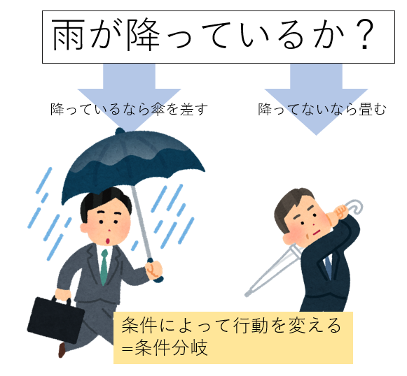
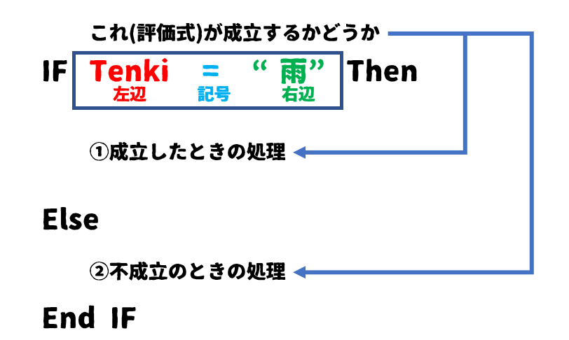
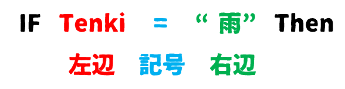

# 06-If文の使い方

## 条件分岐

プログラムでは条件分岐という考え方があります。  
条件分岐というと難しく聞こえますが、少し噛み砕いた例を挙げると、「今、雨が降っているか？」を判断し、「降っている」なら「傘をさす」、「降っていない」なら「傘をたたむ」

といったように、何かが条件にあっているかどうかを判断し、その結果によって動作を変えるというための構文になります。  


## 実際のIf文

実際にやってみましょう。
下記プログラムを入力し、実行してみてください。

```vb
Sub main()

    Dim Tenki as String

    Tenki = "雨"

    If Tenki = "雨" Then
        msgbox "雨なので傘を差します"
    Else
        msgbox "雨ではないので傘を畳みます"
    End If

End Sub
```

今回は変数`Tenki`に`雨`を設定したので｀雨なので傘を差します`というメッセージが表示されたと思います。  

それでは変数`Tenki`の値を`雨`以外のものに書き換えて再度実行してみてください。
```vb
Sub main()

    Dim Tenki as String

    Tenki = "晴れ"

    If Tenki = "雨" Then
        msgbox "雨なので傘を差します"
    Else
        msgbox "雨ではないので傘を畳みます"
    End If

End Sub
```

すると`雨ではないので傘を畳みます`と表示されたと思います。  

このように、`If ～ Then`の間に書かれた条件式が成立しているかどうかによって動作を変えることが出来ます。

## If文の文法説明

If文の基本形は下記のようになっています。  
  

Ifの直後に書かれた式(評価式といいます)が成立するかどうかを判定し、成立すればIf～Elseの間に書かれた処理を実行。  

不成立の場合はElse～End Ifの間に書かれた処理を実行します。


Ifのあとに書かれている評価式をもう少し細かく分解してみるとこのようになります。  
  

IFのあとに左辺、記号、右辺、そして`Then`が揃っているのが評価式の基本形になります。

この`記号`部で使うことのできる記号(比較演算子といいます)は下表のようになっています。  
このうち、下の2つは特殊な比較ですので今は覚える必要はありません。  


| 演算子 | 説明                 | 例                | 例の場合に得られる結果                 |
| ------ | -------------------- | ----------------- | -------------------------------------- |
| <      | 小さい               | 8 < 5             | FALSE                                  |
| <=     | 以下                 | 3 <= 8            | TRUE                                   |
| >      | 大きい               | 8 > 5             | TRUE                                   |
| >=     | 以上                 | 3 >= 8            | FALSE                                  |
| =      | 等しい               | 3 = 8             | FALSE                                  |
| <>     | 等しくない           | 3 <> 8            | TRUE                                   |
| Like   | 文字列のあいまい比較 | Name Like "あ*の" | ”あ"で始まり"の"で終わる文字列の時True |
| Is     | オブジェクトの比較   | objTS Is Nothing  | objTSがNothingの時True                 |

## まとめ

- 条件分岐とは、ある条件が成立する時とそうでない時で行動を分ける処理のこと
- VBAではIf～Then～Elseという構文を使う
- Ifの後に書かれた式(評価式)は右辺、記号、左辺から成る
- 評価式に使える記号は決まっている