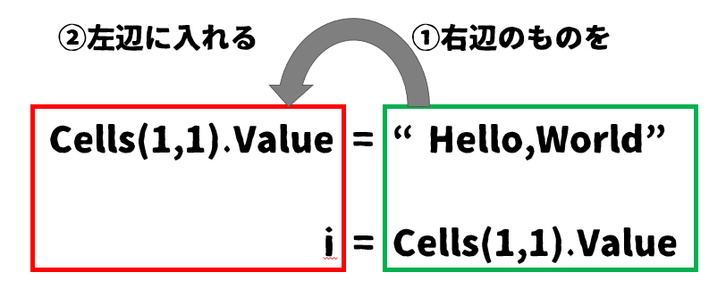
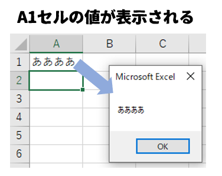

# 07-セルの値を取得する

4章でも出てきたこの図ですが、これまでに学習した範囲をこの図に当てはめておさらいしてみます。


3章では下記のようなプログラムでセルへ値を表示することが出来ました。
```vb
    Cells(1, 1).Value = "Hello,World"
```
これは**出力**にあたります。  

4章では変数を、5章ではFor～Loop構文を、6章ではIf～Then～Else構文を学習しました。これは様々な**処理**をするのに必要なルールでした。  


上図に当てはめるとまだ**入力**できる方法が不足しています。  
**入力**できる方法としては  
- ユーザーがキーボードから入力した値を使う
- セルに書き込まれた値を使う
- ファイルに書き込まれた値を使う
- クリップボードにコピーされている値を使う

など、様々な入力のやり方が考えられますが、ここでは`セルに書き込まれた値を取得してその後の処理に使う`という方法を学びます。  


## セルに書かれた値を取得する

VBAに限らず、世の中の大半のプログラム言語は基本的に右辺のものを左辺に代入するという書き方になります。  



セルに書かれた値を`変数i`に代入する場合は、このようになります。(A1セルに入力されている場合)

```vb
    Dim i
    i = Cells(1,1).Value
```

では実際にA1セルの値が取れているかどうか確認してみます。  

A1セルに適当な文字を書いた後に下記プログラムを実行してみてください。
```vb
Sub main()
    Dim i
    i = Cells(1,1).Value
    msgbox i,vbOkOnly
End Sub
```


うまく表示されればOKです。