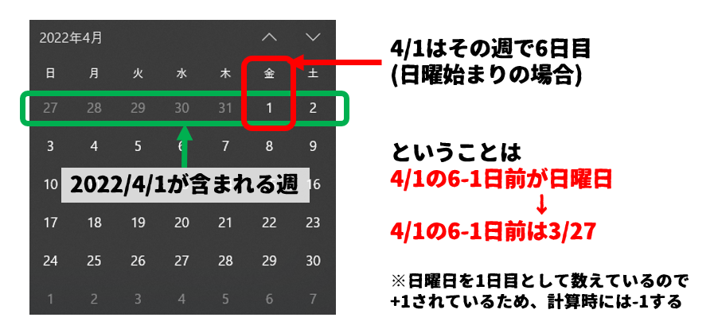

# 08-プログラムを作成する

ここまででプログラムを作成するために必要な最低限の知識が身につきましたので早速作成してみましょう。  

## プログラムを作成するための基本的な考え方

プログラムを作成する場合の基本的な考え方を紹介します。  
とはいえ、これが正解というものがあるわけではありませんし、作成するプログラムの規模や人数によっても変わってきます。  

今回紹介するものはひとつの例として参考にしてください。  


### 完成時のイメージを確認する

まず作成したいものはどういったものなのか、見た目や処理をざっくり確認します。  

これは手書きの図やExcel/Powerpointなどで作った図などでも構いません。イメージを固めるために一度整理しておきましょう。  

この段階で可能であれば使ってみた場合の操作感を想像して、不足している機能などがあれば追加しておきます。

今回はこのような万年カレンダーを作ります。

  


実際のところ、万年カレンダーはマクロでなくてもExcel関数と書式設定だけで作成できてしまうのですが、それを言ってしまうとマクロの授業になりませんので今回はあえてマクロで作成します。  


### データの流れや入力/出力を整理する

イメージがざっくり掴めたら、このマクロのデータの入力と出力を確認します。  

言い方を変えると「何の情報をもとに動作して」「どういうことをするのか」を整理するということです。

今回は下図のように  
`C1セルとD1セルに入力された年・月をもとにして`  
`A3セルからG8セルまでの間にカレンダーを書く`  
マクロになります。


### 自分が(人が)手作業でやる場合にはどうするのかを考える

いろいろやり方が考えられると思いますが、今回はこのように考えました。

1. C1,D1に書かれた値を元に、カレンダーを表示する月の初日(1日)を決定する
2. 1で求めた日が含まれる週の日曜日は何月何日なのかを調べる
3. A3セルからG8セルまで1日づつ増やして日付を入力する


この作業のコツは、なるべく作業を細分化することです。  
もっと大きな作業で区切ってしまうと、後の工程でマクロを書こうとしたときに「どうやってやるの・・・？」と詰まったり、そのやり方では出来ないという事に気づいてやり直しになってしまったりします。  

もちろん、慣れてくれば大きな作業で区切っても構いませんが、最初は細かく具体的な作業単位で区切るようにしましょう。

### 実際に書く(1)

本来はもっと細かな設計が必要な場合も多いですが、今回くらいの小規模のマクロであればもう書き始めて良いと思います。  


まずは、マクロの大枠を書きます。

```vb
Sub main()

End Sub
```

この状態では「何もしないマクロ」になっています。  
ここに、まずは先程考えた作業単位をメモとして記入します。  
```vb
Sub main()

    'C1,D1に書かれた値を元に、カレンダーを表示する月の初日(1日)を決定する

    '1で求めた日が含まれる週の日曜日は何月何日なのかを調べる

    'A3からG8セルまで1日づつ増やして日付を入力する

End Sub
```
行の先頭をシングルクォーテーション`'`で開始すると、その行はプログラムではない扱いになりますので、好きな言葉を入力できます。
これを`コメント`と呼びます。  

シングルクォーテーションは`Shift + 7`キーで入力できます。  

### 実際に書く(2)
コメントの下にそれぞれコメントに沿ったプログラムを作成していきます。  
まずはこれを作ります。  

```vb
    'C1,D1に書かれた値を元に、カレンダーを表示する月を決定する
```
年と月の値は入力値として与えられているので、これを元に特定の日を求めます。  
googleで`VBA 年月日`と検索するとこのようなものが見つかりましたので、これが使えそうです。


調べてみると、年、月、日を元にして日付型の値を求めてくれる命令でした。今回の目的にぴったりあっているのでこれを使います。  

使い方は
`DateSerial(年,月,日)`とすれば良いようです。  
これで求めたい日は月の初日(1日)なので日は1、年と月はそれぞれC1セル、D1セルの値をそのまま持ってきます。

出来上がった結果は変数に格納します。今回はFirstDateという変数名にしました。  

C1セルの値はCells(1,3).Value  
D1セルの値はCells(1,4).Value  
で取得することが出来ます。(7章参照)

```vb
    'C1,D1に書かれた値を元に、カレンダーを表示する月を決定する
    FirstDate = DateSerial(Cells(1, 3).Value, Cells(1, 4).Value, 1)
```
### 実際に書く(3)

次の行に進みます。

```vb
    '1で求めた日が含まれる週の日曜日は何月何日なのかを調べる
```

ここでやろうとしていることを念の為詳しく説明します。  
例えば2022/4/1の場合、下図緑枠が2022/4/1が含まれる週になります。  
その週の日曜日というと、赤枠の`2022/3/27`となります。  
これを求めようとしています。  
  

なぜこのような事をしているかというと、月によって初日(1日)は何曜日から始まるかがバラバラであるため、指定月の1日が開始するセルはA3セルからG3セルのどこかになります。  
対策としては

1. 指定月の1日が始まるセルを計算して、そこから書き始める
2. 必ずA3セルから書き始めることにして、A3セルが何月何日なのかを求める  

の2つがあると思いますが、今回は2を採用しました。  

ということで、`指定した日が含まれる週の日曜日が何月何日かを調べる`必要があります。

またgoogle先生に聞いてみます。  
`VBA 週 曜日`で検索するとこのようなものが見つかりました。


調べてみると、`Weekday`という命令を使うと、指定した日がその週で何日目なのかを返してくれるようです。  

これをうまく使えば`指定月の1日が含まれる週の日曜日`を求めることができそうです。


WeekDayの使い方は`WeekDay(指定日,週の基準曜日)`とすれば良いようです。  

`週の基準曜日`は下表に従って指定します。  
| 定数        | 値 | 説明                           |
| ----------- | -- | ------------------------------ |
| vbUseSystem | 0  | システムの設定値を使用します。 |
| vbSunday    | 1  | (既定値) 日曜                  |
| vbMonday    | 2  | 月曜                           |
| vbTuesday   | 3  | 火曜                           |
| vbWednesday | 4  | 水曜                           |
| vbThursday  | 5  | 木曜                           |
| vbFriday    | 6  | 金曜                           |
| vbSaturday  | 7  | 土曜                           |

今回は日曜始まりで計算したいので、vbSundayを指定します。  
結果を受け取る変数は`DiffDay`としました。  
指定日は前の行で求めたFirstDateに格納されているはずです。  

ここまでをおさらいします。
2023年4月のカレンダーを表示しようとしている場合  
`FirstDate・・・・2023/4/1　が入っている`  
`DiffDay・・・・・2023/4/1　が含まれる週の日曜日を基準として、2023/4/1が何日目なのかが入っている。(6日目)`

```vb
    '1で求めた日が含まれる週の日曜日は何月何日なのかを調べる
    DiffDay = Weekday(FirstDate, vbSunday)
```

では結局、日曜日は何月何日なのでしょうか。  

日曜日からかぞえて6日後が2023/4/1なのですから、2023/4/1から6を引けば何月何日かがわかるはずです。  

ここで注意しなければならないのはDiffDayに格納されている数値(6)は、日曜日を1日目としてカウントしている点です。○日後とか○日前の計算をするときは日曜日は0日目扱いになるのでその分を考慮する必要があります。  

```vb
    PrintDate = FirstDate - DiffDay + 1
```

今回求めたい日は`PrintDate`という名前の変数に格納することにします。  
`FirstDate`(2023/4/1) からDiffDay(6)を引きます。それだと前述のように引きすぎになるため、1日足して目的の日を求めます。  

この書き方が直感的に分かりづらければ  
```vb
    PrintDate = FirstDate - (DiffDay - 1)
```
としても構いません。(どちらも同じことです)

これで下図赤枠の日曜日、つまりこのカレンダーを書き始める日が何月何日なのかを求めることが出来ました。
  

### ここまでを動かしてみる

ここまで3つの変数に必要な値をセットしてきました。  

狙い通り動いているでしょうか？  
実際に動かしてみたいと思います。  

ここまでのプログラムをもう一度掲載しておきます。  

```vb
Sub main()

    Dim FirstDate As Date
    Dim DiffDay As Integer
    Dim PrintDate As Date

    'C1,D1に書かれた値を元に、カレンダーを表示する月の初日(1日)を決定する
    FirstDate = DateSerial(Cells(1, 3).Value, Cells(1, 4).Value, 1)
    '1で求めた日が含まれる週の日曜日は何月何日なのかを調べる
    DiffDay = Weekday(FirstDate, vbSunday)
    PrintDate = FirstDate - (DiffDay - 1)

    'A3からG8セルまで1日づつ増やして日付を入力する
End Sub
```
最初の3行(Dim ～)はなくても動きますが、できれば変数を宣言してから使うというクセをつけておきましょう。

では下図のように  
  1. Sub main()からEnd Subの間のどこでもいいのでクリックしてカーソルを置く
  2. 実行ボタンを押す

をやってみてください。  


うまくいった場合、何も起こりません。

これは実行されていないわけではなく、実行されたけど一瞬で完了してしまったからです。  

これではうまくできているかよく分からないのでプログラム実行中に一時停止してみます。


上図のあたりをクリックすると下図のように●がつき、行全体が強調表示されます。  

これは`ブレークポイント`と呼ばれ、プログラムの実行がここまで到達したら一時停止してくれるという機能です。  


先ほどと同じようにプログラムを実行してみます。  


すると、このように黄色い矢印と強調表示がされました。  
この黄色い矢印は、`今プログラムはここで止まっています`という意味です。

この停止した状態では、それぞれの変数の現時点での値を見ることができます。  

例えばプログラム中の`FirstDate`の上にマウスカーソルを持っていき、しばらくおいておくと下図のようにFirstDateの値が表示されます。  


また、いちいちマウスカーソルを持っていくのが面倒な場合は調査したい変数を右クリックし、`ウォッチ式の追加`を行い、そのままOKすると、画面下部の`ウォッチウィンドウ`にリアルタイム表示されます。  


FirstDate、DiffDay、PrintDateが狙い通りの値になっているか確認してみてください。  


おそらく、PrintDateだけが狙い通りの値になっていないと思います。

これは、現時点ではプログラムはブレークポイント行の先頭で停止しているため、PrintDateの計算はまだ行われておらず、0が入っているためです。  
  

停止状態で`F8`キーを押すとプログラムが1行だけ実行されます。  
一度だけ`F8`キーを押し、ウォッチウィンドウの値を再確認してみてください。  

すべてが狙い通りの値になっていればここまでのプログラムは正しい言えます。  
引き続き、プログラム作成作業に戻りましょう。  

### 実際に書く(4)

2023/4/1のカレンダーを作成するためには何月何日から書き始めればよいのかがわかりました。  

あとはカレンダーを書いていくだけです！  

ところで何週間分のカレンダーを書けばよいのでしょうか。  

1ヶ月は最大31日あり、1週間は7日あります。
```
31 ÷ 7 = 4 あまり 3
```
つまり4週間分のカレンダーだけだと足りない場合があることが分かります。  
また、1日が日曜日から始まるとは限りません。最遅の場合には土曜日から開始されるため更に1週間ズレます。
そのため、6週間分のカレンダーを書くことにしましょう。


カレンダーに書く値はずっと、「前日に+1日した値」となっています。  

では、どのセルに書くかというのはどうやって決めればよいでしょうか。  

それぞれのセルの場所をプログラムで記述する場合には
```vb
Cells(行,列).Value
```
という書式を使うことを思い出してください。  

ここで、Cells(行,列)でカレンダーの位置を表記してみます。


Cells(行,列)のうち、`列`については1から7まで1づつ増加していき、`行`については3から8まで1づつ増加していくという関係性になっていることが分かります。

全体を考えるとややこしいですが、一つ隣のセルとの関係を見ると行もしくは列の値が1づつ違うだけの関係が繰り返されています。  

繰り返しといえば以前やった`For～Next構文`を使えばうまく当てはめることができそうだということに気づきます。  

では実際に考えてみましょう。


#### ループを使わなかった場合を考える

`For～Next構文`を使わない場合、プログラムはこうなります。  
```vb
    Cells(3, 1).Value = PrintDate
    Cells(3, 2).Value = PrintDate + 1
    Cells(3, 3).Value = PrintDate + 2
    Cells(3, 4).Value = PrintDate + 3
    Cells(3, 5).Value = PrintDate + 4
    Cells(3, 6).Value = PrintDate + 5
    Cells(3, 7).Value = PrintDate + 6
    Cells(4, 1).Value = PrintDate + 7
    Cells(4, 2).Value = PrintDate + 8
    Cells(4, 3).Value = PrintDate + 9
                    ・
                    ・
                    ・
    Cells(8, 4).Value = PrintDate + 38
    Cells(8, 5).Value = PrintDate + 39
    Cells(8, 6).Value = PrintDate + 40
    Cells(8, 7).Value = PrintDate + 41

```
数値だけに注目してみると、Cells(行,列)のうち`行`の値は7行おきに1づつ増え
`列`の値は1行おきに1づつ増えています。  
`PrintDate`の値についても1行おきに1づつ増えていますが、`列`との違いは初期値が0である点です。  

これを満たす`For～Next構文`を書けばいいということになります。  

まず1行おきに1づつ増えるという簡単な規則になっている`列`のループから記述します。  

```vb
        For d = 1 To 7
            Cells(???,d).Value = PrintDate + ???
        Next
```
とりあえず何を書いていいかわからない場所は???にしておきました。  

この`For～Next構文`の意味をおさらいしておくと

```vb
'dの値を1から7まで1づつ変化させて
            Cells(???,d).Value = PrintDate + ???
'を繰り返す
```
ということになります。  

これで列のループは完成しました。あとはこれをさらに6週分繰り返すだけです。  

先程の
```vb
        For d = 1 To 7
            Cells(???,d).Value = PrintDate + ???
        Next
```
を、処理の塊として考えると、これを6週分繰り返すだけなので、ここでも`For～Next構文`が使えそうです。  

何をやるかは別として、6週分繰り返す`For～Next構文`を考えてみます。  
先程の絵をみると、行数は3行目から8行目までの5行であることがわかります。


つまり、プログラムにするとこうなります。  
wの値が3から始まり、8になるまでの6回分、何らかの処理を繰り返すということです。

```vb
    For w = 3 To 8
        'ここに6回繰り返したい処理を書く
    Next
```

6回繰り返したい処理は何かというと先程の`列`の7回繰り返す処理ですから、それをここに入れてやります。  
  
入れた結果はこうなります。  

```vb
    For w = 3 To 8
        For d = 1 To 7
            Cells(???,d).Value = PrintDate + ???
        Next
    Next

```

改めてCells(???,d)について考えてみます。  

先程は何を入れていいか分かりませんでしたが、ここには3から8まで7行おきに1づつ変化する変数を入れてやれば良いことは分かっています。  

それは上記のプログラムでいうと変数wですね。  

ということでここには`Cells(w,d)`が入ります。  

```vb
    For w = 3 To 8
        For d = 1 To 7
            Cells(w,d).Value = PrintDate + ???
        Next
    Next
```

PrintDateの右側の???については、0から始まり1日ごとに1づつ増える値を入れてやります。  
そのような変化をする変数は現時点では存在しないため、作成してやりましょう。  

```vb
    Dim i as Integer

    i = 0
    For w = 3 To 8
        For d = 1 To 7
            Cells(w,d).Value = PrintDate + i
            i = i + 1
        Next
    Next
```
このようになりました。  
今回は変数名`i`として定義し、ループに入る前に0をセットしておきます。  
```vb
            Cells(w,d).Value = PrintDate + i
```
を通過したあとにiの値を1増やしてやります。  

#### 参考資料
各ループ回ごとのw,d,iのそれぞれの値をまとめておくとこのようになります。 
| | wの値          | dの値 | iの値 |    |
| -------------- | ----- | ----- | -- |
| 1回目のループ  | 3     | 1     | 0  |
| 2回目のループ  | 3     | 2     | 1  |
| 3回目のループ  | 3     | 3     | 2  |
| 4回目のループ  | 3     | 4     | 3  |
| 5回目のループ  | 3     | 5     | 4  |
| 6回目のループ  | 3     | 6     | 5  |
| 7回目のループ  | 3     | 7     | 6  |
| 8回目のループ  | 4     | 1     | 7  |
| 9回目のループ  | 4     | 2     | 8  |
|  | ・ |  |  |
|  | ・ |  |  |
|  | ・ |  |  |
| 10回目のループ | 4     | 3     | 9  |
| 41回目のループ | 8     | 6     | 40 |
| 42回目のループ | 8     | 7     | 41 |
### 実際に書いてみる(まとめ)

ここまでのプログラムを一度まとめておきます。

```vb
Sub main()

    Dim FirstDate As Date
    Dim PrintDate As Date
    Dim DiffDay As Integer

    'C1,D1に書かれた値を元に、カレンダーを表示する月の初日(1日)を決定する
    FirstDate = DateSerial(Cells(1, 3).Value, Cells(1, 4).Value, 1)

    '1で求めた日が含まれる週の日曜日は何月何日なのかを調べる
    DiffDay = Weekday(FirstDate, vbSunday)
    PrintDate = FirstDate - DiffDay + 1

    'A3からG8セルまで1日づつ増やして日付を入力する
    Dim i as Integer

    '週ごとのループ
    For w = 3 To 8
        '日ごとのループ
        For d = 1 To 7
            Cells(w,d).Value = PrintDate + i
            i = i + 1
        Next
    Next
End Function
```

せっかく完成したので実行してみましょう。  


このようになってしまうと思います。  
これは各セルに入力しているのが「年/月/日」の値のため、長くて表示しきれないため####と表示されてしまっています。  

元々、2022年4月のカレンダーなので各セルには日のみが表示されていれば十分ですので、そのように設定を変更しましょう。  

A3からG8セルまで選択して`セルの書式設定`を開き、下図のように設定してください。  


狙い通り、日付のみの表示にすることができました。  


