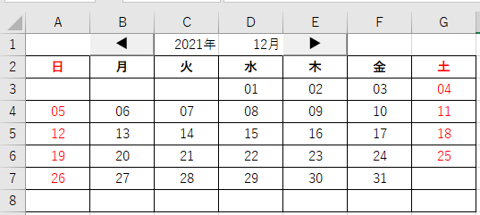

# Excel VBA ハンズオン講義

万年カレンダーの作成を通してExcelマクロ(VBA)の最初の一歩を学ぶための資料です。



最終的にはこれが完成します

## 対象者

今まで一度もプログラムに触れたことがない人  
PCでアプリ版のExcel(2016以降)が使用できる人(ブラウザ経由でのExcelにはVBAがありません)

## 学習範囲

VBAの基本的な文法と、マクロ開発の流れを学習することができます。  
VBAもプログラム言語の一つであるため、ここで学習した文法や考え方は他の言語でも応用することが可能です。

1. Excel(アプリ版)でVBA開発をするための環境構築
2. まずは動かしてみる-Hello,World作成(指定したセルに任意の文字を表示する)
3. 変数と演算について
4. セルに入力された文字を取得する
5. 入力された文字を受け取って計算し、他のセルに書き出す(変数について)
6. For文の基礎的な文法
7. If文の基礎的な文法
8. プログラムの書き方のルール・マナーとその理由
9.  用意されている関数を使う
10. オリジナルの関数を作る
11. ボタンと連動させる

本編とは別に、下記の内容についても説明します

- デバッグの仕方(ブレイクポイント、ステップ実行、ウォッチウィンドウ)
- エラーの対処法
- プログラム作成のコツ(ロジックの作り方、ちょっとづつ作ってみる)
- イベントドリブンについて

## 学習のコツ

これまでプログラムを様々な人に教育してきた経験から、いくつか学習のコツを紹介しておきます。 

### いきなりすべてを理解しようとしなくていい

プログラムは命令を書くのに必要な前準備や、一見余計なことに見えるが実はやっておいたほうがいいこと、独特な概念をさらに発展させた書き方など、初学時にはとても理解しづらいけどそのうち難なくわかるようになるような物がたくさんあります。
(こういうもののことを`おまじない`と表現したりすることもあります)

初学時はモチベーションが高いので「一字一句すべて理解してから先に進みたい」と思う人も多いですし、その気持ちは理解できますが、それをやると「プログラムよくわからない……自分には向いていない……」と挫折する場合が多いです。  
実際のところ理解できないのはその人の能力の問題ではなく、学習するタイミングの問題です。  
良くわからない記述は「そこでどんなことをしようとしているのか」という大枠だけを認識して、あまりこだわらず先に進むことをおすすめします。  


### サンプルプログラムをコピペしない

このコンテンツや市販の本など、どんな教本でも「このサンプルプログラムを入力して動かしてみましょう」というくだりがあります。  
そこでやりがちなのが「コピペ」です。入力ミスすることもなく、確実に動かせるので便利ですが学習時にはコピペせず、自分でキーボードから入力してください。

これは学習に取り組む姿勢の問題、などではなく、実際に学習効果が大きい方法として様々な先人が奨めている方法です。(プログラマー界では`写経`と言ったりします)

意味がわからなくても自ら考えながら入力することで気づきや理解が深まったり、逆に文法に対する疑問が湧いたりします。コピペをすると細部を気にしなくなるのでそういった効果が期待できません。

コピペを一切禁止。などとは言いませんが、2～3ページに渡る長いプログラムでない限りは手で入れるようにしてみてください。

### エラーメッセージを読むクセをつける

プログラムを書いて実行するとたいていエラーが発生します。  
それは何か問題があるからなのですが、「エラーメッセージが何言っているか分からなくて出るのが怖い」という方がよくいます。  
なれていない方がそう感じてしまうのは仕方のないことですが、どんなベテランプログラマーになってもエラーメッセージは普通に出しますので怖がる必要はありません。  
ベテランプログラマーはエラーメッセージが出たときの対処方法を数多く知っているので対処が早かったり、エラーメッセージの数が少なかったりはしますが、これは経験によって身につくものです。  

インターネットがある現代では、エラーメッセージをそのままググると答えが出てくる場合も多いので、理解できないエラーメッセージは一度ググってみるということもやってみてください。

### サンプルコードを勝手に改造してみる

何かプログラムが出来たら、ぜひ勝手に改造してみてください。  
勝手に改造してみて、狙い通りに変更できればそれでOKですし、想定外の挙動やエラーが発生した場合でも「なぜそうなってしまったのか」を考えることで学べることは多いです。


## ソースコード

参考までに、このマクロの全プログラムコードを下記に示します。  
講義の中で詳細に解説していきます。

```vb
Sub main()
    Call DrawCalendar(Cells(1, 3).Value, Cells(1, 4).Value)
End Sub

Function DrawCalendar(TargetYear As Integer, TargetMonth As Integer)

    Dim FirstDate As Date
    Dim PrintDate As Date
    Dim DiffDay As Integer
    
    FirstDate = DateSerial(TargetYear, TargetMonth, 1)
    DiffDay = Weekday(FirstDate, vbSunday)
    
    PrintDate = FirstDate - DiffDay + 1
    
    For w = 3 To 8
        For d = 1 To 7
            If Month(PrintDate) = Month(FirstDate) Then
                Cells(w, d).Value = PrintDate
            Else
                Cells(w, d).Value = ""
            End If
            PrintDate = PrintDate + 1
        Next
    Next

End Function
```